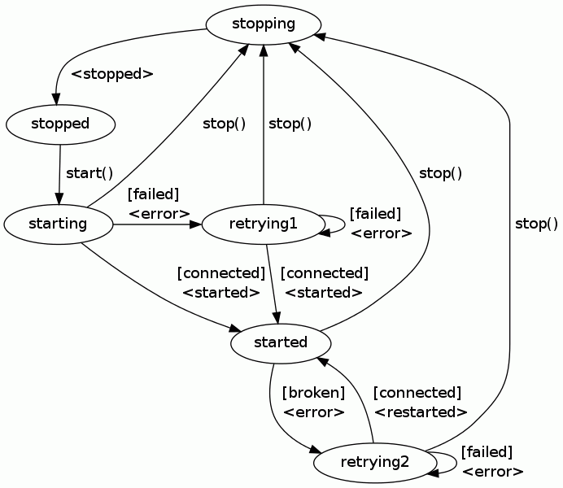

## Non-blocking API

Example code for using the non-blocking client to send a message

```java
NonBlockingClient.create("amqp://localhost", new NonBlockingClientAdapter() {
  public void onStarted(NonBlockingClient client, Void context) {
    SendOptions opts = SendOptions.builder().setQos(QOS.AT_LEAST_ONCE).build();
    client.send("/public", "Hello World!", null, opts, new CompletionListener() {
      public void onSuccess(NonBlockingClient client, Void context) {
        client.stop(null, null);
      }
      public void onError(NonBlockingClient client, Void context, Exception exception) {
        client.stop(null, null);
      }
    }, null);
  }
  public void onDrain(NonBlockingClient client, Void context) {}
}, null);
```

Example code for receiving messages published to the '/public' topic.

```java
public static void main(String[] args) {
  NonBlockingClient client = NonBlockingClient.create("amqp://localhost", null, null);
  client.subscribe("/public", new DestinationAdapter() {
    public void onMessage(NonBlockingClient client, Void context, Delivery delivery) {
      switch (delivery.getType()) {
        case BYTES:
          BytesDelivery bd = (BytesDelivery)delivery;
          System.out.println(bd.getData());
          break;
        case STRING:
          StringDelivery sd = (StringDelivery)delivery;
          System.out.println(sd.getData());
          break;
      }
    }
  }, null, null);
}
```

State machine that underpins the client:  


## Getting started

The client depends on the following jar files (and has been built and tested
using the indicated versions):

Dependency      | Version  
--------------- | -------------
Google Gson     | 2.2.4
Logback Classic | 1.1.2
Logback Core    | 1.1.2
Apache Netty    | 4.0.21.Final
SLF4J           | 1.7.5
Stateless4J     | 2.5.0
  
The client also includes a `pom.xml` that can be used to install it into a
Maven repository and automatically resolve these dependencies. For example:
    
```
mvn install:install-file -Dfile=mqlight-api-1.0-SNAPSHOT.jar -DpomFile=pom.xml
mvn dependency:get -Dartifact=com.ibm.mqlight.api:mqlight-api:1.0-SNAPSHOT
```

## Plug-points for extending the client

The client implements a number of its components in such a way as they can be
replaced by alternative implementations.

The following table describes the various plug-points provided by the client.
For more information about an individual plug-point, please consult the
Javadoc for the relevant interface.

Interface                                    | Description                                                                                                                                                                                                                                        | Supplied implementations
-------------------------------------------- | -------------------------------------------------------------------------------------------------------------------------------------------------------------------------------------------------------------------------------------------------- | ------------------------------------------------------------------------------------------------------------------------------------------------------------------------------------------------------------------------------------------------------------------------------------------------------------------------------------------------------------------------------------------------------------------------------------------------------------------------------------------------------------------------------------------------------------------------------------
com.ibm.mqlight.api.callback.CallbackService | A plug point for the code that is run each time the client needs to call back into application code.                                                                                                                                               | The client supplies two implementations. The first is: com.ibm.mqlight.api.callback.impl.SameThreadCallbackService, which calls back into application code using whatever thread calls in to the plug-point. This introduces minimal overhead on running callbacks - but is not suitable for callbacks that block. The second implementation is: com.ibm.mqlight.api.callback.impl.ThreadPoolCallbackService which schedules callbacks into a threadpool. The default is com.ibm.mqlight.api.callback.impl.ThreadPoolCallbackService.
com.ibm.mqlight.api.endpoint.EndpointService | A plug point for determining the location of the MQ Light server (or service) to connect to.                                                                                                                                                       | The client supplies two implementations, which can be chosen between depending on the value of the `service` parameter passed into the `create` method used to create the client. The first implementation is: com.ibm.mqlight.api.impl.endpoint.SingleEndpointService, which always returns the same endpoint details and is useful when connecting to the stand-alone MQ Light server. The second implementation is: com.ibm.mqlight.api.impl.endpoint.BluemixEndpointService, which (as the name suggests) looks up instances of the MQ Light service in the Bluemix environment.
com.ibm.mqlight.api.network.NetworkService   | A plug point for interfacing with the network used between the MQ Light client and server.                                                                                                                                                         | The client supplies an Apache Netty-based implementation: com.ibm.mqlight.api.impl.network.NettyNetworkService
com.ibm.mqlight.api.timer                    | A plug point for scheduling work to be done at some point in the future. The client uses this to implement inactivity timeouts for the AMQP protocol, and also a delay between repeated attempts to establish connectivity to the MQ Light server. | The client supplies an implementation based on ScheduledThreadPoolExecutor: com.ibm.mqlight.api.impl.timer.TimerServiceImpl
  
## Some notes on logging

The client logs using the SLF4J interfaces. If it is used in a runtime where
an implementation of SLF4J has already been started, then it will use this for
logging. If it is used in a runtime where Logback is used to implement SLF4J
and the LogManager has not been started then it will configure Logback itself.
Currently this involves enabling WARN and above logging unless the
MQLIGHT_JAVA_LOG environment variable is set (to any value) in which case
DEBUG and above logging is enabled using Logback's BasicConfigurator.

## Current limitations

* The client does not provide the ability to send/receive JSON formatted
  messages. This affects interoperation with other MQ Light clients (e.g.
  Node.js)
* Message properties only support string values.
* No support for dispatching application callbacks into a pool of threads.
  Callbacks are run on whatever thread needs to call back into application
  code - which is not a good fit for some workloads.

